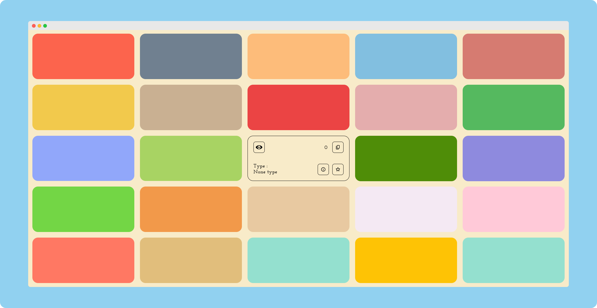

# [Color-Blindness-Simulator](https://praashoo7.github.io/Photo-Gallery-React/)

This is a Color Blindness Simulator where you can simulate all 7 types of color blindness and see each type displayed. You can also simply copy the "EYE" and paste it on your webpage and go through all filters to check how accessible your webpage is for the Color Blind individuals. There is also a React Component for it!

## Button

This is what the Copied Button looks like which you can add on your webpage to go through all Filters! 
Get the Button [Here](https://github.com/Praashoo7/Color-Blindness-Simulator/blob/main/Button/Button.html), Raw Source Code for the Button [Here](https://github.com/Praashoo7/Color-Blindness-Simulator/blob/main/Button/Button_RAW.html) and the React Component [Here](https://github.com/Praashoo7/Color-Blindness-Simulator/blob/main/ReactComponent/ReactComponent.js).

## Credits

Filters are from [Chromium](https://developer.chrome.com/docs/chromium/cvd) & [hail2u](https://github.com/hail2u) [[Repo]](https://github.com/hail2u/color-blindness-emulation)

## License

Color-Blindness-Simulator is open-source Software Licensed under the [MIT License](https://github.com/Praashoo7/Color-Blindness-Simulator/blob/main/LICENSE)
