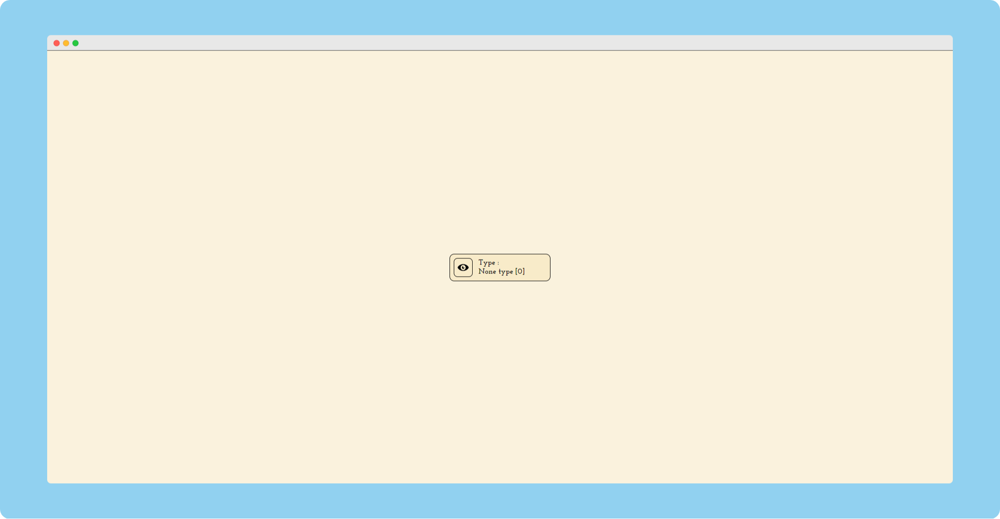

# [Color-Blindness-Simulator](https://praashoo7.github.io/Photo-Gallery-React/)

This is a Color Blindness Simulator where you can simulate all 7 types of color blindness and see each type displayed. You can also simply copy the "EYE" and paste it on your webpage and go through all filters to check how accessible your webpage is for the Color Blind individuals.

## Copied Button

This is what the Copied Button[iframe] looks like which you can add on your webpage to go through all Filters! 
Or you can get the Source Code [Here](https://praashoo7.github.io/Color-Blindness-Simulator/Button/index.html).

## Credits

Filters are from [hail2u](https://github.com/hail2u) [Repo](https://github.com/hail2u/color-blindness-emulation)

## License

Color-Blindness-Simulator is open-source Software Licensed under the [MIT License](https://github.com/Praashoo7/Color-Blindness-Simulator/blob/main/LICENSE)   

P.S : I am aware that chrome already provides these filters in it! I just created this as a side project. Also Chrome includes filters for 4 main types of Color Blindnesses but here i have tried to include all 7 of them. Some filters are from chrome itself and others are from hail2u. The other types are not drastically different from the main 3 types but i just added them in case anyone needs them!
