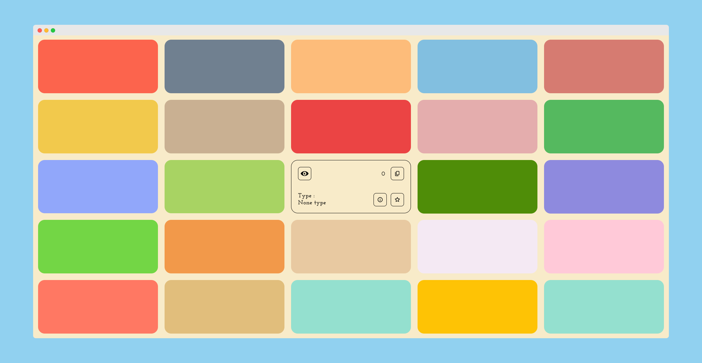
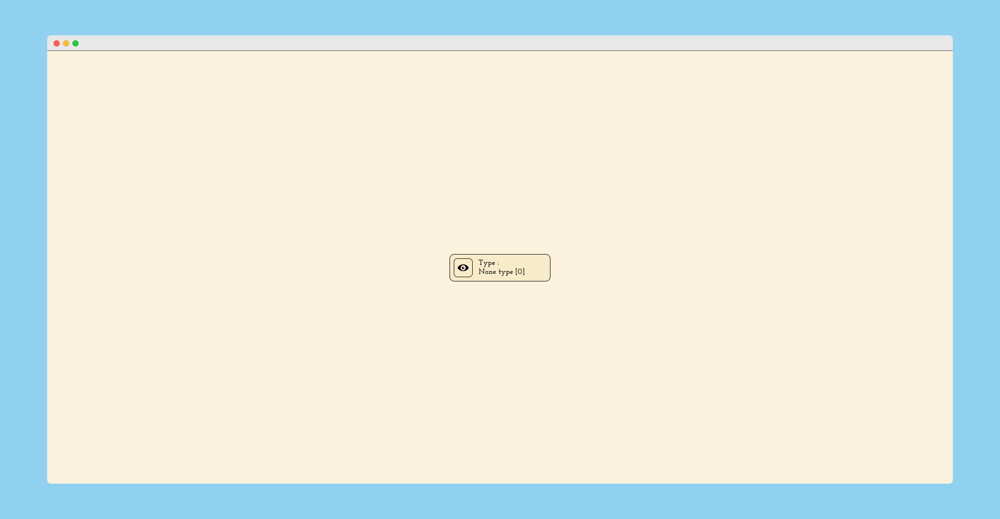

# [Color-Blindness-Simulator](https://praashoo7.github.io/Photo-Gallery-React/)

## Credits

## Credits

Filter from [hail2u](https://github.com/hail2u) [[Repo](https://github.com/hail2u/color-blindness-emulation)]

## License

Color-Blindness-Simulator is open-source Software Licensed under the [MIT License](https://github.com/Praashoo7/Color-Blindness-Simulator/blob/main/LICENSE)
